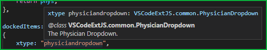
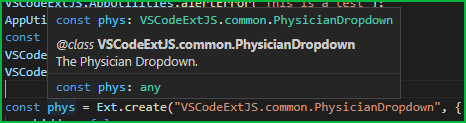
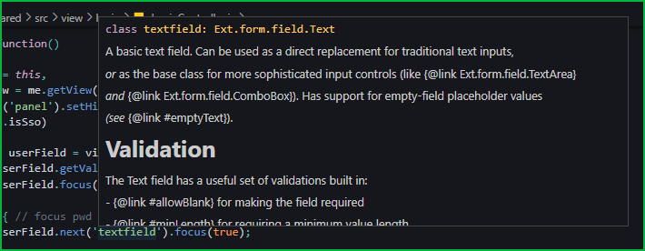
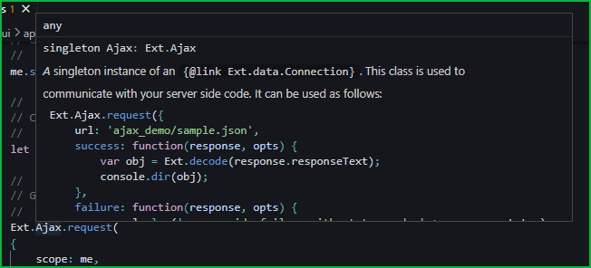
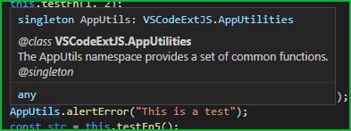
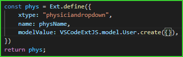
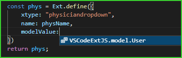
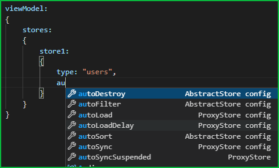
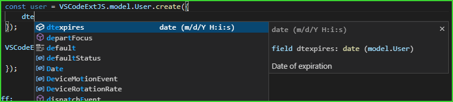
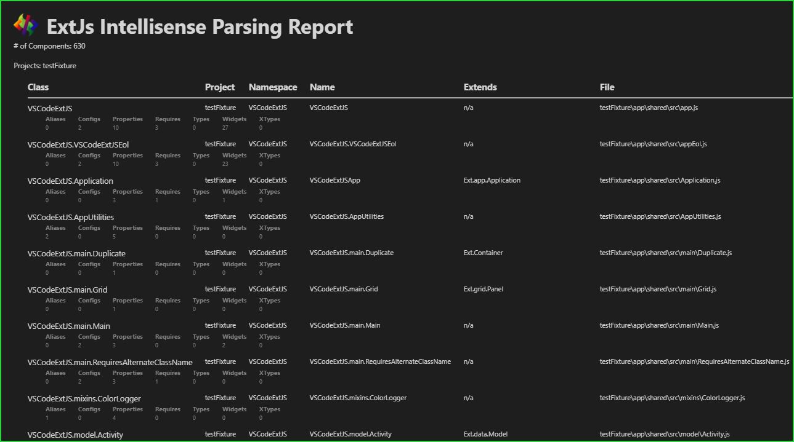

# ExtJs Intellisense - Code Completion, and More

_**IMPORTANT NOTES**_: *

This extension has surpassed where I was going to take it.  Considering a pay scheme (cheap, e.g. $10 - $20), with free usage up to the # of to-be-determined number of parsed components.

## Table of Contents

- [ExtJs Intellisense - Code Completion, and More](#extjs-intellisense---code-completion-and-more)
  - [Table of Contents](#table-of-contents)
  - [Description](#description)
  - [File Indexing](#file-indexing)
  - [Configuration](#configuration)
    - [Configuration - The `app.json` ExtJs Project File](#configuration---the-appjson-extjs-project-file)
    - [Configuration - The `.extjsrc.json` Configuration File](#configuration---the-extjsrcjson-configuration-file)
    - [Configuration - The `name` Property (Required)](#configuration---the-name-property-required)
    - [Configuration - The `classpath` Property (Required)](#configuration---the-classpath-property-required)
    - [Configuration - The `exclude` Property](#configuration---the-exclude-property)
    - [Configuration - The `include` Property](#configuration---the-include-property)
    - [Configuration - The `framework` Property](#configuration---the-framework-property)
    - [Configuration - VSCode Quick Suggestions](#configuration---vscode-quick-suggestions)
  - [Compared to Sencha Extension](#compared-to-sencha-extension)
  - [JsDoc](#jsdoc)
    - [JsDoc - Links](#jsdoc---links)
  - [Code Completion](#code-completion)
  - [GoTo Definitions](#goto-definitions)
  - [GoTo Type Definitions](#goto-type-definitions)
  - [Method Signatures](#method-signatures)
  - [Diagnostics](#diagnostics)
  - [Task Provider](#task-provider)
  - [The Create New Class Command](#the-create-new-class-command)
  - [AST Parsing Reports](#ast-parsing-reports)
  - [ESLint Tips](#eslint-tips)
  - [Caching](#caching)
  - [App-Publisher](#app-publisher)
  - [Thank You](#thank-you)
  - [Feedback & Contributing](#feedback--contributing)
    - [Rate It - Leave Some Stars](#rate-it---leave-some-stars)
  - [Donations](#donations)
  - [TODO](#todo)
  - [Open Source Projects](#open-source-projects)

## Description

ExtJs Intellisense is a VSCode Language Server that provides most Intellisense and other language features that cannot be parsed by a normal JavaScript parser, due to the nature of the Ext.define implementation.

- Supports multi-root workspace
- Automatic parsing, no manual configuration needed
- Method, Config, and Property JSDoc/Comments Hover
- Code Completion Intellisense with Inline JSDoc/Comments
- Method Signature Intellisense with Inline JSDoc/Comments
- Method Parameter Validation
- XType Validation and Completion (Credits to Original Author **qzsiniong**)
- Method and Class Validation

See the section [Compared to Sencha Extension](#compared-to-sencha-extension) for a detailed feature list.

## File Indexing

The first time the extension loads, it will index all ExtJs files found within the VSCode workspace, as specified by the Sencha project files (i.e. app.json and workspace.json) or the extension's configuration.  *First time indexing* may take several minutes depending on the size of your workspace, the # of ExtJs projects in the workspace, and the size of the ExtJs projects.  Once indexed though, cached indexing will be less than 10% the time it takes to perform the full indexing when opening the VSCode workspace.

## Configuration

Assuming a standard JavaScript linter is already in place, the ExtJs Language Server attempts to provide the missing functionality that a standard JavaScript Language Server cannot handle due to the nature of the ExtJS class definitions (Ext.define), which are basically just one function expression per class file as far as a standard JavaScript parser is concerned.

A standard linter used in most all JavaScript projects is [ESLint](https://github.com/eslint/eslint), some quick install details can be found in the [section below](#eslint-tips).  Don't use the *Sencha ESLint Plugin* for linting in your ExtJS projects, it's garbage and will slow everything down like nothing I've ever seen.

This language server looks at your entire workspace, whether single or multi root, and locates ExtJS files in one of three ways, or any combination thereof:

1. app.json / workspace.json
2. .extjsrc.json
3. settings.json / VSCode Settings

Whether or not an [app.json](#the-appjson-extjs-project-file), [.extjsrc.json](#the-extjsrcjson-configuration-file), or [include](#configuration---the-include-setting) path is used, there are two required properties that must be present for any of the configuration types.  For **include** paths, see the [section below](#configuration---the-include-setting) describing how to specify both of these properties in the Settings entries.  These two properties are [name](#configuration---the-name-setting-required)) and [classpath](#configuration---the-classpath-setting-require).

### Configuration - The `app.json` ExtJs Project File

The **app.json** file is a part of all Sencha Cmd and Sencha ext-gen generated Open Tooling projects.  If an **app.json** file is located, the namespaces and classpaths are extracted and added to indexing.  If a corresponding **workspace.json** file is located in the same directory as an **app.json** file, classpaths are extracted from the *packages.dir* property and added to indexing.  The *packages.dir* property should be a comma delimited string of package paths included in the application classpath, these normally specify the paths to the packages included in the *requires* array property of the **app.json** file.

### Configuration - The `.extjsrc.json` Configuration File

The **.extjsrc.json** / **.extjsrc** file is a custom file that can be placed into any directory.  If an **.extjsrc** file is located, the namespace and classpaths are extracted and added to indexing.

The **.extjsrc** file can contain any of the defined properties of a Sencha ExtJS project **app.json** file, but must in the least contain the following two properties:

1. name
2. classpath

See [here](https://github.com/spmeesseman/vscode-extjs-info/example/.extjsrc.json?raw=true) for a simplified example .extjsrc file.

### Configuration - The `name` Property (Required)

The `name` is a string specifying the project name, or main project namespace.  FOr example, if your ExtJS files are defined like:

    VSCodeExtJs.view.common.Users
    VSCodeExtJs.view.common.Admins

Then the default namespace / project name, in most cases, would be "VSCodeExtJS".  This field corresponds to the `name` property of an [app.json](#the-appjson-extjs-project-file) file.

### Configuration - The `classpath` Property (Required)

The `classpath` is a string, or an array of strings, of where the ExtJS JavaScript files can be located.  This field corresponds to the `classpath` property of an [app.json](#the-appjson-extjs-project-file) file.

Note that classpaths defined in `toolkit` object properties in [app.json](#the-appjson-extjs-project-file) will be merged into the main object classpath for indexing.

That's it, ExtJS Language Server should start indexing your files once a valid configuration file has been found.

### Configuration - The `exclude` Property

The **exclude** path(s) can be set to a string or an array of globs that should be ignored during indexing.  Keep in mind that for app.json and open tooling projects, this might not work as expected, as only defined `classpaths` are indexed anyway.

Projects in a multi-root workspace can also be added to the `exclude` list.  For example, a project called *vscode-estjs* can be ignored with the glob pattern **\*\*/vscode-extjs/\*\***

### Configuration - The `include` Property

The **include** path(s) can be set to a string or an array of globs of additional paths to be indexed.  These strings must be in the form:

    NAME|RELATIVE_DIRECTORY

The `NAME` part represents the `name` field [described below](#configuration---the-name-setting-required), this is associated with the base *namespace* of an ExtJs defined component.  The `RELATIVE_DIRECTORY` is a directory that is *relative* to the workspace folders and represents the `classpath` field [described below](#configuration---the-classpath-setting-required).

### Configuration - The `framework` Property

The **framework** path can be set to a string representing the path to an ExtJs framework to use for validation.

### Configuration - VSCode Quick Suggestions

In order for *inline* completion to work correctly, ensure the VSCode editor setting `quickSuggestions` is enabled.  An appropriate setting could be:

    "editor.quickSuggestions": {
        "other": true,
        "comments": false,
        "strings": false
    }

Or:

   "editor.quickSuggestions": true

Other recommended settings for ExtJs Intellisense that may affect other language servers are:

    "editor.suggestSelection": "first",
    "editor.wordBasedSuggestions": false,
    "javascript.suggest.names": false,
 
## Compared to Sencha Extension

This extension is unable to perform the app/workspace commands using Sencha Cmd that the Sencha extension provides.

Aside from that, the ExtJs Language Server provides everything else it is capable of and more:

1. Free :)
2. Intellisense and Code Completion for class members and local controller variables created with Ext.create.
3. Go To Definition for classes and class string literals.
4. Static configuration file for specifying project name and classpaths to parse.
5. Multi-Root Workspace Support.
6. Intellisense with Full JSDoc.
7. Method Signature / inline parameter helper with JsDoc.
8. Hover JsDoc for all classes, methods, properties, configs, xtypes and class string literals.
9. Static vs. Instance Intellisense.
10. Go To Type Definition for variables and xtypes.
11. XType validation.
12. Store and model type validation.
13. Requires, uses, models, stores Arrays validation.
14. Ext.create() and static model/store create() validation.
15. Diagnostic *Quick Fix* for invalidated types and xtypes.
16. Parses [app.json](#the-appjson-extjs-project-file), *workspace.json*, and *package.json* files for auto-import of classpaths, including dependencies.
17. Turn on/off the inclusion of deprecated class members into Intellisense directly in VSCode Settings.
18. Turn on/off the inclusion of private class members into Intellisense directly in VSCode Settings.
19. Configure specific classpaths for Indexing directly in VSCode Settings.
20. @since, @deprecated, and @private JsDoc tags and Intellisense tags.
21. Parsing performance is slightly slower the first time the extension loads, but subsequent usage sees parsing performance @ ~ 1.4-1.5x faster.
22. Parses ES2016+ syntax using latest Babel code parser and AST traversal.
23. Configurable validation timeout useful for slower systems.

## JsDoc

|Screenshots||
|-|-|
|||
|||
|||

JsDoc comments are most useful to a JavaScript programmer but useless to an ExtJs programmer.  Not anymore... They are parsed and used where applicable just like a standard JavaScript Language Server:

- Hovering over a component class, variable, or other definition
- When a completion item is highlighted
- When a method signature helper is invoked, parameter by parameter

ExtJs component classes, methods, configs, and properties can be documented with JsDoc using the same structure as the ExtJs Framework JsDoc comments.  Generally, it's plain old JsDoc with exception of a few ExtJs specific properties - `@cfg` and  `@singleton`.

Examples:

    /**
     * @class AppName.util.Utilities
     * 
     * @singleton
     * 
     * Common utility methods
     */
    Ext.define(
    {
        singleton: true,

        /**
         * @property {Boolean} dirty
         * @since 1.2.0
         */
        dirty: false,

        /**
         * @property {Boolean} modified
         * @deprecated 1.2.0 Use {@link #dirty}
         */
        modified: false,

        /**
         * @method getUserName
         * Gets the name of the logged in user
         * @param {Boolean} useTitleCase If `true`, returns the name in title/proper casing.
         * @returns {String}
         */ 
        getUserName: function(useTitleCase)
        {

        }

    });

    /**
     * @class AppName.view.main.Main
     * 
     * The main screen
     */
    Ext.define(
    {
        extend: 'Ext.Panel',
        config:
        {
            /**
            * @cfg {String} userName
            * The username to display on the top banner
            */ 
            userName: null
        }
    });

### JsDoc - Links

You can specify the base documentation site of the "See ..." links per namespace.  The default is:

    docURL: {
        "Ext": "https://docs.sencha.com/extjs/7.4.0"
    }

If you generate your own docs using Sencha Cmd, you can add that too:

    docURL: {
        "Ext": "https://docs.sencha.com/extjs/7.4.0",
        "MyProjectName": "https://my.website.com/projectname/docs",
        "MyCompanyName.ux": "https://my.website.com/companyname/projectname/docs"
    }

## Code Completion

TODO

|Screenshots||
|-|-|
|||
|||

## GoTo Definitions

TODO

## GoTo Type Definitions

TODO

## Method Signatures

TODO

## Diagnostics

TODO

## Task Provider

Provides build tasks for Sencha Cmd and Webpack configured projects.

Supports integration with the [Task Explorer](https://marketplace.visualstudio.com/items?itemName=spmeesseman.vscode-taskexplorer) extension via it's external provider API.

## The Create New Class Command

Available in the editor and explorer context menus is the `ExtJs: Create New Class` command.  TO specify a template to be used when invoking the command on a directory, set the `classTemplate` setting in the ExtJs Intellisense settings.  FOr example:

    /**
     * @class ${classname}
     */
    Ext.define("{classname}",
    {
        extend: "",
        requires: [

        ]
    });

The variables `${classname]` and `{classname}` in this example will be replaced by the specified and constructed class name.

## AST Parsing Reports

For debugging or curiosity, a report can be generated listing all parsed components and the properties found.  You can generate a report in the explorer context menus using the `ExtJs: View Parsing Report` menu item.

## ESLint Tips

Always use [ESLint](https://github.com/eslint/eslint) for JavaScript/TypeScript projects.  It is **GREAT**.  To install ESLint to a project, run the following command from the root project directory containing the package.json file:

    npm install --save-dev eslint

**Or** install globally:

    npm install -g eslint

A configuration file is required in the root project directory, usually the same directory that the *package.json* file would be in.  The file can be a JavaScript ot a JSON file:

    .eslintrc.js
    .eslintrc.json

To create a default configuration file in a project that does not contain one, run the following command from the root project directory containing the *package.json* file:

    npx eslint --init

You should now have an [.eslint.js](#the-extjsrcjson-configuration-file) file in the directory the command has been ran in.

Add your ExtJS globals to the config file, or any other globals not understood by eslint, primarily *Ext* ad your project namespace:

    "globals": {
        "Ext": "readonly",
        "MyApp": "writable",
        "SharedArrayBuffer": "readonly",
        "ArrayBuffer": "readonly",
        "DataView": "readonly"
    }

Linting is dynamic as you edit files.  But also create a task in package.json for linting reports.  For example, if the JavaScript code is located in the directory *app*:

    "scripts": {
        ...existing scripts...
        "lint": "eslint -c .eslintrc.json --ext .js ./app"
    }

**NOTE**: Do not use the *Sencha ESLint Plugin* for linting, it's garbage and will slow everything down like nothing I've ever seen.

## Caching

The first time the extension activates, it will index all ExtJS files found within the workspace.  This could take a while depending on the # of ExtJS projects/files found.  The ExtJS Language Server will cache the syntax tree after the initial build, improving startup performance by > 10x.

## App-Publisher

This extension was released with the [app-publisher](https://github.com/spmeesseman/app-publisher) tool.

## Thank You

Whenever I start a project I always look for a good base to start from and for this extension I lucked out and found a perfect one written by **qzsiniong** from GitHub, his project is located [here](https://github.com/qzsiniong/vscode-extjs).  That project has been scrapped as a base, but learning from it to build this current extension was invaluable. 

## Feedback & Contributing

- Please report any bugs, suggestions or documentation requests via the
  [Issues](https://github.com/spmeesseman/vscode-extjs-info/issues)
- Feel free to submit
  [Pull Requests](https://github.com/spmeesseman/vscode-extjs-info/pulls)
- [Contributors](https://github.com/spmeesseman/vscode-extjs-info/graphs/contributors)

### Rate It - Leave Some Stars

Please rate your experience with stars... [like five of them ;)](https://marketplace.visualstudio.com/items?itemName=spmeesseman.vscode-extjs&ssr=false#review-details)

## Donations

If my work and this extension has made your life easier, consider a [donation](https://www.paypal.com/cgi-bin/webscr?cmd=_donations&business=YWZXT3KE2L4BA&item_name=extjs&currency_code=USD).  All donations go straight to the *Single Dad ATM*.

## TODO

See the [current TODO List](https://github.com/spmeesseman/vscode-extjs-info/blob/master/.todo?raw=true).  Tracked using the [TODO+ VSCode Extension](https://marketplace.visualstudio.com/items?itemName=fabiospampinato.vscode-todo-plus).

## Open Source Projects

|Package|Use Case|Repository|Marketplace|
|-|-|-|-|
|app-publisher|Release Automation / CI|[GitHub](https://www.npmjs.com/package/@spmeesseman/app-publisher)|[Npmjs.org Registry](https://www.npmjs.com/package/@spmeesseman/app-publisher)|
|arg-parser|Node Argument Parser|[GitHub](https://github.com/spmeesseman/arg-parser)|[Npmjs.org Registry](https://www.npmjs.com/package/@spmeesseman/arg-parser)|
|code-package|Code Dev Environment|[GitHub](https://github.com/spmeesseman/code-package)|[GitHub Releases](https://github.com/spmeesseman/code-package/releases)|
|env-ci|CI ENvironment Detection|[GitHub](https://github.com/spmeesseman/env-ci)|[Npmjs.org Registry](https://www.npmjs.com/package/@spmeesseman/env-ci)|
|extjs-pkg-filterbar|ExtJS Grid Filter Bar|[GitHub](https://github.com/spmeesseman/extjs-pkg-filterbar)|[Npmjs.org Registry](https://www.npmjs.com/package/@spmeesseman/extjs-pkg-filterbar)|
|extjs-pkg-fontawesome|ExtJS FontAwesome Integration|[GitHub](https://github.com/spmeesseman/extjs-pkg-fontawesome)|[Npmjs.org Registry](https://www.npmjs.com/package/@spmeesseman/extjs-pkg-fontawesome)|
|extjs-pkg-fontawesome-pro|ExtJS FontAwesome Pro Integration|[GitHub](https://github.com/spmeesseman/extjs-pkg-fontawesome-pro)|[Npmjs.org Private Registry](https://www.npmjs.com/package/@spmeesseman/@spmeesseman/extjs-pkg-fontawesome-pro)|
|extjs-pkg-intltelinput|ExtJS IntlTelInput Wrapper|[GitHub](https://github.com/spmeesseman/extjs-pkg-intltelinput)|[Npmjs.org Registry](https://www.npmjs.com/package/@spmeesseman/extjs-pkg-intltelinput)|
|extjs-pkg-mantis|ExtJS MantisBT Integration|[GitHub](https://github.com/spmeesseman/extjs-pkg-mantis)|[Npmjs.org Registry](https://www.npmjs.com/package/@spmeesseman/extjs-pkg-mantis)|
|extjs-pkg-plyr|ExtJS Plyr Wrapper|[GitHub](https://github.com/spmeesseman/extjs-pkg-plyr)|[Npmjs.org Registry](https://www.npmjs.com/package/@spmeesseman/extjs-pkg-plyr)|
|extjs-pkg-tinymce|ExtJS TinyMCE Wrapper|[GitHub](https://github.com/spmeesseman/extjs-pkg-tinymce)|[Npmjs.org Registry](https://www.npmjs.com/package/@spmeesseman/extjs-pkg-tinymce)|
|extjs-pkg-websocket|ExtJS WebSocket Wrapper|[GitHub](https://github.com/spmeesseman/extjs-pkg-websocket)|[Npmjs.org Registry](https://www.npmjs.com/package/@spmeesseman/extjs-pkg-websocket)|
|extjs-pkg-webworker|ExtJS WebWorker Wrapper|[GitHub](https://github.com/spmeesseman/extjs-pkg-webworker)|[Npmjs.org Registry](https://www.npmjs.com/package/@spmeesseman/extjs-pkg-webworker)|
|jenkins-mantisbt-plugin|Jenkins MantisBT Integration|[GitHub](https://github.com/spmeesseman/jenkins-mantisbt-plugin)|[Npmjs.org Registry](https://www.npmjs.com/package/@spmeesseman/jenkins-mantisbt-plugin)|
|jenkins-utility-server|Jenkins Desktop Server|[GitHub](https://github.com/spmeesseman/jenkins-utility-server)|[Npmjs.org Registry](https://www.npmjs.com/package/@spmeesseman/jenkins-utility-server)|
|mantisbt|MantisBT Custom Site|[GitHub](https://github.com/spmeesseman/mantisbt)|[GitHub Releases](https://github.com/spmeesseman/mantisbt/releases)|
|ApiExtend|MantisBT API Extensions|[GitHub](https://github.com/mantisbt-plugins/ApiExtend)|[GitHub Releases](https://github.com/mantisbt-plugins/ApiExtend/releases)|
|CommitReact|MantisBT Post Commit Actions|[GitHub](https://github.com/mantisbt-plugins/CommitReact)|[GitHub Releases](https://github.com/mantisbt-plugins/CommitReact/releases)|
|GanttChart|MantisBT Gantt Chart|[GitHub](https://github.com/mantisbt-plugins/GanttChart)|[GitHub Releases](https://github.com/mantisbt-plugins/GanttChart/releases)|
|IFramed|MantisBT IFramed Pages|[GitHub](https://github.com/mantisbt-plugins/IFramed)|[GitHub Releases](https://github.com/mantisbt-plugins/IFramed/releases)|
|ProjectPages|MantisBT Custom Nav Buttons|[GitHub](https://github.com/mantisbt-plugins/ProjectPages)|[GitHub Releases](https://github.com/mantisbt-plugins/ProjectPages/releases)|
|Releases|MantisBT Releases Management|[GitHub](https://github.com/mantisbt-plugins/Releases)|[GitHub Releases](https://github.com/mantisbt-plugins/Releases/releases)|
|SecurityExtend|MantisBT SPAM Filter|[GitHub](https://github.com/mantisbt-plugins/SecurityExtend)|[GitHub Releases](https://github.com/mantisbt-plugins/SecurityExtend/releases)|
|ServerFiles|MantisBT Server File Editor|[GitHub](https://github.com/mantisbt-plugins/ServerFiles)|[GitHub Releases](https://github.com/mantisbt-plugins/ServerFiles/releases)|
|svn-scm-ext|VSCode SVN Extension|[GitHub](https://github.com/spmeesseman/svn-scm-ext)|[Visual Studio Marketplace](https://marketplace.visualstudio.com/itemdetails?itemName=spmeesseman.svn-scm-ext)|
|vscode-extjs|VSCode ExtJS Intellisense|[GitHub](https://github.com/spmeesseman/vscode-extjs-info)|[Visual Studio Marketplace](https://marketplace.visualstudio.com/itemdetails?itemName=spmeesseman.vscode-extjs)|
|vscode-taskexplorer|VSCode Tasks Management|[GitHub](https://github.com/spmeesseman/vscode-taskexplorer)|[Visual Studio Marketplace](https://marketplace.visualstudio.com/itemdetails?itemName=spmeesseman.vscode-taskexplorer)|
|vscode-vslauncher|VSCode VS Project Launcher|[GitHub](https://github.com/spmeesseman/vscode-vslauncher)|[Visual Studio Marketplace](https://marketplace.visualstudio.com/itemdetails?itemName=spmeesseman.vscode-vslauncher)|
